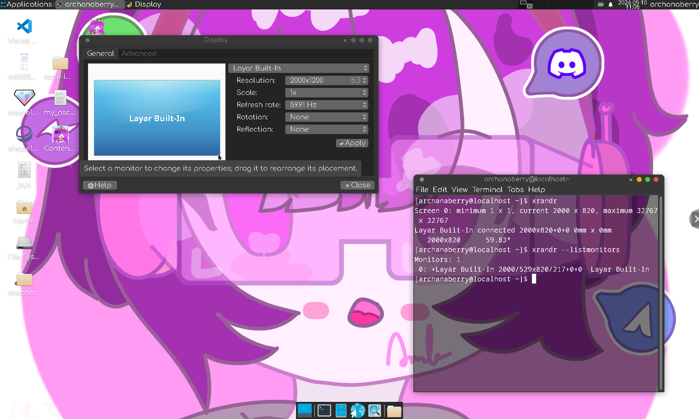
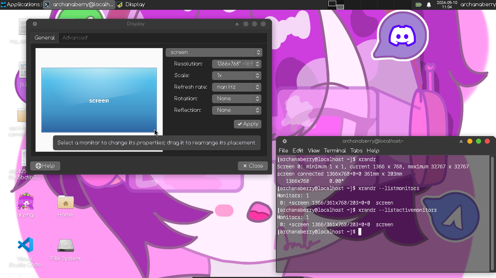

# Tx11nVNC
Dual connection screen to display via Termux x11 on VNC ✧⁠◝⁠(⁠⁰⁠▿⁠⁰⁠)⁠◜⁠✧


# Setup

## Install package for termux x11 and vnc service's
 
```
pkg update && pkg upgrade
pkg install proot pulseaudio termux-x11 x11-repo
pkg install xorg-xrandr xfce4
pkg install xorg-x11-server-Xvfb x11vnc
```

## Don't forget to install dbus
* For Arch Linux distro's such as Manjaro, Endeavour, or etc...
```
sudo pacman -S dbus
``` 

* For Debian distro's such as Ubuntu, Linux Mint, or etc...
```
sudo apt install dbus
```

## If you want to run it, you need to write command this!
* This script for XFCE4
```
sh termux_x11.sh & sh vnc.sh
```

## These are ideal for remote access via SSH, and i use PuTTY.


## This my tablet portait mode (1200x2000)


## This my tablet landscape mode (2000x1200)


# What the other display is cannot detected and does not appear on each devices?
* Termux X11 "Layar Built-In" (My Tablet 2000x1200)


* VNC "screen" (My laptop legacy 1366x768)
